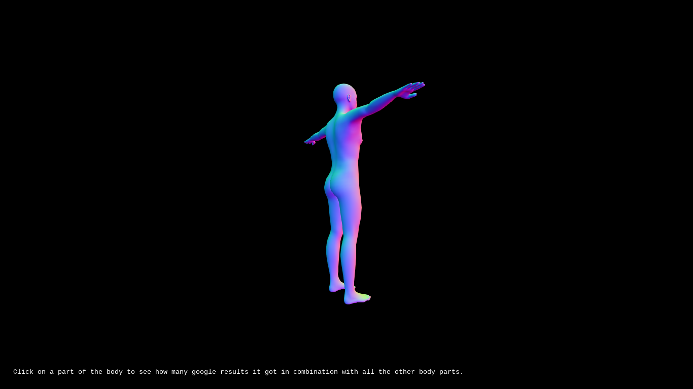

# howTheInterNetSeesUs

A visualization to deform a human body according to a matrix of Google search results of combinations of search terms related to the human body.

## User Stories
- Bob wants to see a human body without any deformation (to get a first impression).
- Bob wants to click in one of the body parts to see how the body parts change there size (according to the amount of Google search results).

## References/Inspiration
- Graham (http://www.patriciapiccinini.net/388/58) 
- Cortical homunculus (https://en.wikipedia.org/wiki/Cortical_homunculus) 
